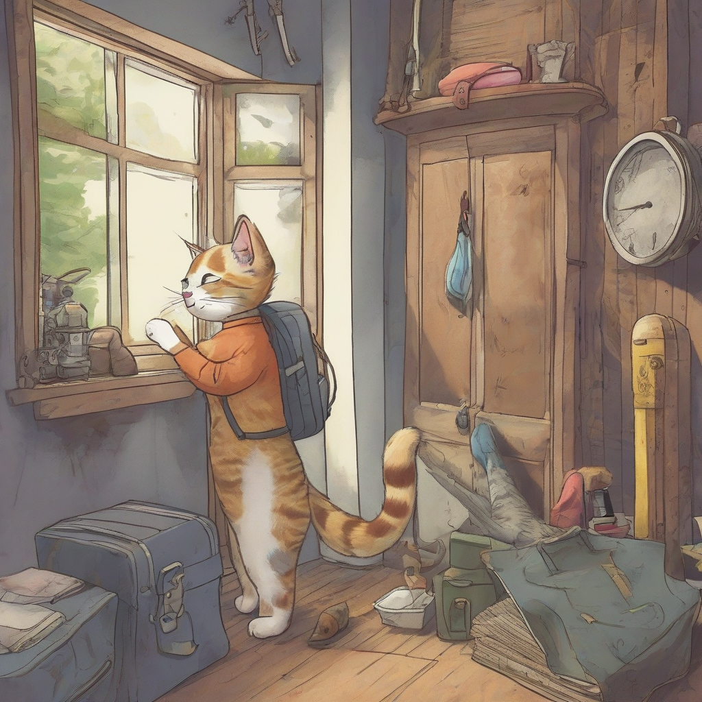
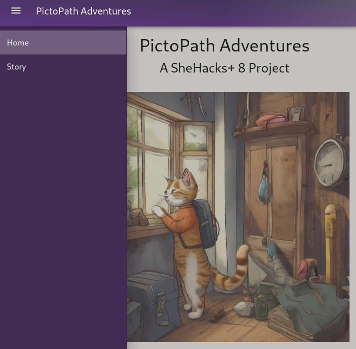

# PictoPath Adventures - SheHacks+ 8 Project
<a href="https://devpost.com/software/uwu-yjqtrv">Link to Devpost!</a>



Image generated with Stability AI's Stable Diffusion via CloudFlare's Workers AI. 

## Tech & Tools 💻
### Frontend


### Backend


### Other Tools


## Inspiration 💡
Our project was sparked by a previous idea we explored earlier this year, revolving around the utilization of Stability AI's Stable Diffusion to generate images for a software architecture project. Although we initially set that concept aside, the introduction of CloudFlare's Workers AI provided a fresh opportunity to revisit and implement it. The intuitive functionality of Workers AI streamlined access to various machine learning models, transforming our initial inspiration into a tangible reality. 

Plus, we wanted to have fun and immerse ourselves into the heart of SheHacks+ 8's theme this year! 

## What it does 🌟
Introducing PictoPath (*picture-to-path*), where you craft your unique adventure! Harnessing the power of CloudFlare's Workers AI text-to-image models, users can embark on a personalized journey, choosing between a captivating sea voyage or an enthralling jungle expedition in pursuit of hidden treasure. Immerse yourself in an interactive choose-your-own adventure story, where every decision—from character traits to the paths taken—shapes the unfolding narrative. PictoPath invites users to navigate a world of possibilities and uncover the excitement that lies within their chosen path.

## Project Setup and Pre-requisites ✅
Prerequisites include Python 3.7+ and npm version 10.2+. The known compatible versions used include Python 3.12 and npm 10.2.4. 

### Required Packages
### Back-end
Please ensure pip3, flask, flask-cors are installed:
```sh
pip install flask
pip install flask-cors
```
### Front-end
Install the front-end project dependencies with the following command:
```sh
npm install
```

### Compile and Hot-Reload for Development
Use the following command when developing locally:
```sh
npm run dev
```

### Compile and Minify for Production
Use the following command to run the optimized, production version:
```sh
npm run build
```

## The Process, The Challenges, The Accomplishments, and What's Next!
<details>
<summary> How Did We Build It? 🛠️</summary>
Our team has successfully crafted an interactive story AI application, leveraging a powerful stack of tools to ensure a seamless and dynamic user experience. For the front-end, we used JavaScript while employing Vue.js alongside Vuetify, creating an intuitive and responsive user interface. On the back-end, Python and Flask provided the robust foundation, relaying the user's prompts between the front-end and CloudFlare's text-to-image model.

One of the key highlights of our project is the integration of CloudFlare Workers AI, specifically utilizing Stability AI's Stable Diffusion for text-to-image generation. This cutting-edge technology allows us to bring narratives to life with visually compelling and contextually relevant images, enhancing the overall storytelling experience.

To streamline deployment and ensure efficiency, we've harnessed the capabilities of CloudFlare. We utilized CloudFlare CLI (C3 to create Workers and Wrangler to develop and deploy them) and integrated our Vue project with GitHub. This allowed us to automatically deploy our application every time there's a new commit on the main branch. This not only expedites the deployment process but also ensures that our users access the latest enhancements and features with minimal downtime.

In summary, our full-stack AI application merges the strengths of JavaScript (Vue.js), Python (Flask), and the CloudFlare tech stack (C3, Wrangler, and Workers AI) to deliver an engaging and interactive AI story experience. 
</details>

<details>
<summary> Challenges we ran into 🏃‍♀️</summary>
We encountered challenges during the development of our interactive story AI application that required overcoming various hurdles. Firstly, grappling with unfamiliarity with CloudFlare and Workers AI necessitated a thorough exploration to understand how to effectively utilize Workers AI for making requests and integrating text-to-image functionality.

Another obstacle we faced revolved around managing tokens and keys for CloudFlare, adding an extra layer of complexity to the development process. We diligently addressed this challenge to ensure secure and seamless integration.

The deployment process through CloudFlare posed its own set of challenges, requiring us to navigate the intricacies involved in deploying our application using CloudFlare effectively.

Despite our efforts, we encountered reliability issues with the CloudFlare API model, which intermittently became unavailable, hindering the generation of images for our prompts. This required us to implement contingency plans and explore alternative solutions to maintain the application's reliability.

Furthermore, we faced difficulties with a GoDaddy coupon domain, as it turned out to be invalid. This setback prompted us to reassess our domain strategy and find a suitable alternative to ensure a smooth user experience.
</details>

<details>
<summary>Accomplishments that we're proud of 💪</summary>
Our team takes pride in the successful completion of a full-stack application, showcasing our proficiency in both frontend and backend development to create a comprehensive and cohesive user experience.

Implementing an auto-deployment system marked a significant accomplishment for our project, streamlining the deployment process and ensuring that any new commits to the main branch are automatically reflected in the live application. This not only enhances efficiency but also allows us to swiftly integrate new features and improvements.

Embarking on our first experience with a language model and AI was a notable achievement. This endeavor expanded our skill set and opened new possibilities for incorporating advanced technologies into our projects, enhancing the overall capabilities of our interactive story AI application.

The development of our backend infrastructure represented a major milestone for our team. It demonstrated our adaptability and competence in constructing a robust server-side architecture to support the intricate functionalities of the application.

Finally, Jessica's successful initiation into Vue.js marked a noteworthy accomplishment. Her first-time experience with Vue demonstrated our team's commitment to learning and collaboration, enabling us to diversify our skill sets and contribute to the project's success.
</details>

<details>
<summary>What we learned 🤔</summary>
Throughout the development of our interactive story AI application, our team gleaned valuable insights:

- Recognizing the significance of having a well-defined plan and vision became evident as it provided a solid foundation for our project, guiding our efforts and ensuring a cohesive end result.

- The experience of working with Vue.js and Vuetify was notably positive, underscoring the user-friendly nature of these technologies and their seamless integration, contributing to an enjoyable development process.

- Learning the intricacies of Cloudflare's tech stack, encompassing the Cloudflare CLI, C3, Workers AI, and Wrangler, proved instrumental in mastering the deployment and functional aspects of our application. This knowledge enhanced our efficiency and effectiveness in utilizing Cloudflare's tools.

- Understanding how to craft effective prompts for AI model image generation emerged as a crucial skill, influencing the quality and relevance of the images generated by our application. This insight allowed us to create a more immersive and engaging user experience.

- Mastering Axios requests from the frontend to the backend showcased our team's ability to establish smooth communication between these two components, ensuring seamless data flow and enhancing the overall functionality of our interactive story AI application.
</details>

<details>
<summary>What's next for PictoPath-Adventures 🚀</summary>
Looking ahead, our team envisions expanding the richness of our interactive story AI application by introducing a broader array of options and additional adventures, providing users with an even more diverse set of choices to tailor their experiences.

In the pursuit of continuous improvement, our next steps also involve optimizing the user experience by focusing on faster image generation. We are committed to enhancing the efficiency of our application, ensuring that users can enjoy seamless and prompt responses as they navigate through their chosen adventures. In addition, we would also like to look at other forms of storage such as Redis Cloud of caching and additional data storage for images (such as MySQL) to improve performance and scalability. 
</details>

## Screenshots of The Application 📷
### Horizontal navigation bar becomes a vertical stack to demonstrate responsiveness:


### Generate an adventurer with AI text-to-image model based on user's selection of sea voyage, bunny, and lantern item:

